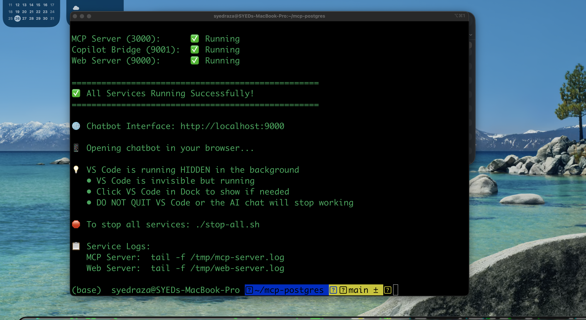

# PostgreSQL Chatbot with GitHub Copilot

Query your PostgreSQL database using natural language through a web interface powered by GitHub Copilot.



*Web interface showing VS Code Copilot Bridge connection with GPT-4 model*

---

## 🚀 Quick Start

```bash
./start-all.sh
```

This will:
1. Start MCP Server (port 3000)
2. Start VS Code + Copilot Bridge (port 9001) - minimized in background
3. Start Web Server (port 9000)
4. Open chatbot in your browser at http://localhost:9000

**To stop all services:**
```bash
./stop-all.sh
```

---

## Features

| Feature | Description |
|---------|-------------|
| **Natural Language Queries** | Ask questions in plain English |
| **GitHub Copilot GPT-4** | Powered by GPT-4 via VS Code Copilot Bridge |
| **Real-time Status** | Shows connection status and model info |
| **Table Visualization** | Results displayed in formatted tables |
| **SQL Transparency** | View generated SQL queries |

---

## Architecture

```
┌─────────────┐    ┌─────────────────┐    ┌─────────────────┐    ┌────────────┐
│   Browser   │───▶│   Web Server    │───▶│  VS Code        │───▶│    MCP     │───▶ PostgreSQL
│  (port 9000)│    │   (Node.js)     │    │  Copilot Bridge │    │   Server   │
└─────────────┘    └─────────────────┘    │  (GPT-4)        │    │ (port 3000)│
                                          └─────────────────┘    └────────────┘
```

**Components:**
| Component | Port | Description |
|-----------|------|-------------|
| Web Server | 9000 | Serves chatbot UI |
| Copilot Bridge | 9001 | VS Code extension connecting to GitHub Copilot |
| MCP Server | 3000 | PostgreSQL database connector |

---

## Requirements

- VS Code installed
- GitHub Copilot subscription (active)
- PostgreSQL database
- Python 3.9+
- Node.js

---

## Installation

1. **Install Python dependencies:**
   ```bash
   pip3 install fastapi uvicorn asyncpg python-dotenv
   ```

2. **Configure database:**
   ```bash
   # Edit mcp-server/.env with your database credentials
   nano mcp-server/.env
   ```

3. **Install VS Code extension:**
   ```bash
   code --install-extension copilot-web-bridge/copilot-web-bridge-1.0.0.vsix
   ```

4. **Start:**
   ```bash
   ./start-all.sh
   ```

---

## Example Queries

```
"Show me all tables"
"List employees with salary above 70000"
"What is the average salary by department?"
"Show me the top 5 highest rated products"
"Describe the employees table"
```

---

## How It Works

1. User types question in browser
2. Request sent to VS Code Copilot Bridge
3. GitHub Copilot (GPT-4) generates SQL
4. MCP Server executes SQL on PostgreSQL
5. Results displayed with AI-generated summary

---

## Database Tools

The MCP server provides these tools:

| Tool | Description |
|------|-------------|
| `query_database` | Execute SELECT queries |
| `execute_sql` | Run INSERT/UPDATE/DELETE |
| `list_tables` | List all tables |
| `describe_table` | Get table structure |
| `get_table_indexes` | View indexes |
| `analyze_query_plan` | EXPLAIN queries |
| `create_table` | Create new tables |
| `create_stored_procedure` | Create procedures |

---

## Important Notes

| Note | Details |
|------|---------|
| **VS Code Required** | Must stay running (minimized is fine) |
| **GitHub Copilot** | Active subscription required |
| **Local Only** | Web interface works on localhost |

**Why VS Code is required:** GitHub Copilot API is only accessible through VS Code's `vscode.lm` API. There is no standalone Copilot API available.

---

## Troubleshooting

**Chatbot not connecting?**
```bash
# Check all services are running
curl http://localhost:9000/health
curl http://localhost:9001/health
curl http://localhost:3000/health
```

**VS Code Copilot Bridge disconnected?**
- Make sure VS Code is running (can be minimized)
- Check GitHub Copilot is signed in

**Database errors?**
- Verify `mcp-server/.env` has correct credentials
- Check PostgreSQL is running

---

## File Structure

```
mcp-postgres/
├── index.html              # Web chatbot interface
├── web-server.js           # Node.js web server
├── start-all.sh            # Start all services
├── stop-all.sh             # Stop all services
├── copilot-web-bridge/     # VS Code extension
│   └── src/extension.ts    # Extension code
└── mcp-server/             # PostgreSQL MCP Server
    ├── server.py           # HTTP server
    └── .env                # Database config
```

---

**Query your database with natural language!**
